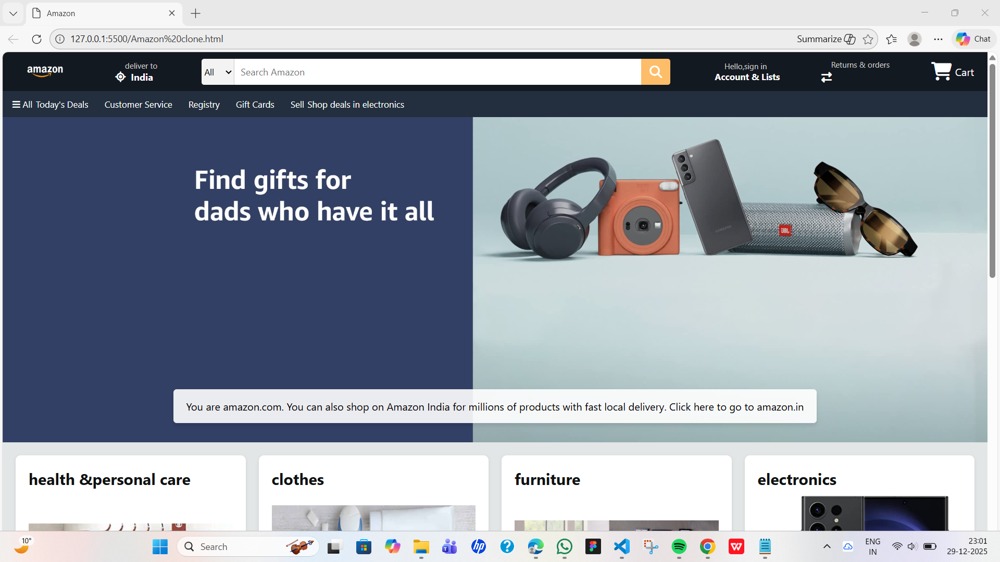
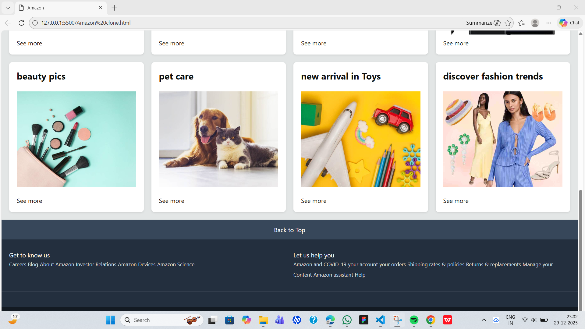

<<<<<<< HEAD
# Amazon Clone 🛒

A simple **Amazon Homepage Clone** built using **HTML and CSS**.  
This project replicates the basic UI of Amazon including navbar, search bar, product sections, and footer.

---

## ✨ Features
- Responsive Amazon-like navbar
- Search bar with category dropdown
- Product grid layout
- Hero banner section
- Clean and modern UI
- Beginner-friendly project

---

## 📸 Screenshots

### 🏠 Homepage View

### 📦 Product Section

---

## 🛠️ Tech Stack
- HTML5
- CSS3
- Font Awesome Icons
  

## 📚 Learning Outcome
- Improved HTML & CSS skills
- Learned layout design using Flexbox & Grid
- Built a real-world UI clone
- Understood responsive design basics

---

## 📌 Disclaimer
This project is for **educational purposes only**.  
All trademarks and images belong to their respective owners.go

# Amazon-Clone
This project is a clone of Amazon's website, created using HTML and CSS to replicate the design and layout of the e-commerce platform. The project demonstrates front-end development skills, focusing on structure, styling, and responsiveness.  Features: Homepage Design: A visually appealing homepage showcasing products and banners.